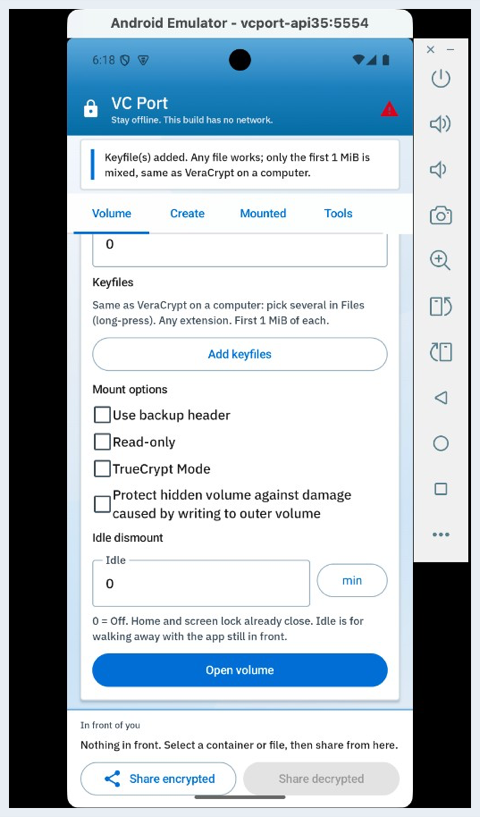
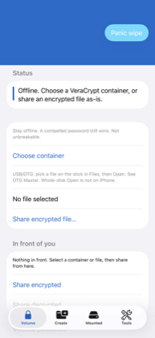
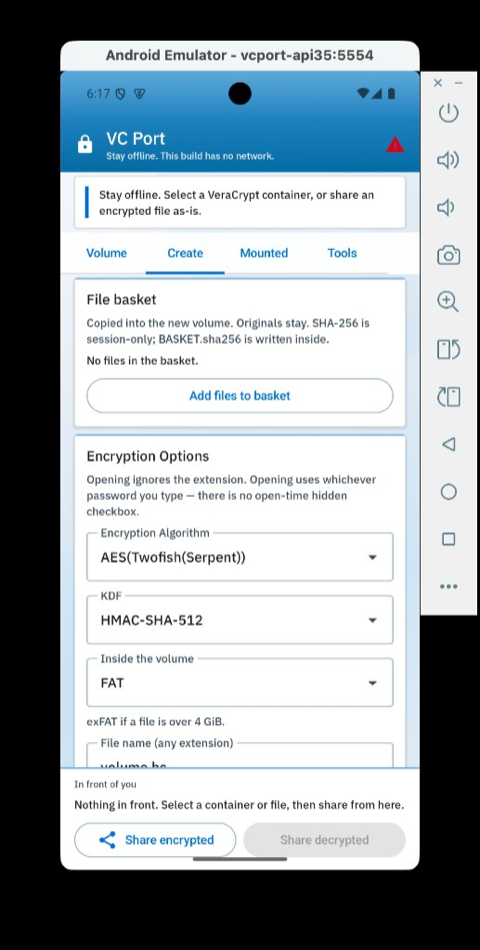
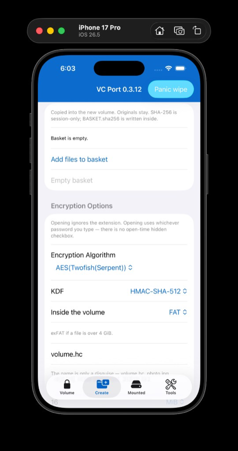
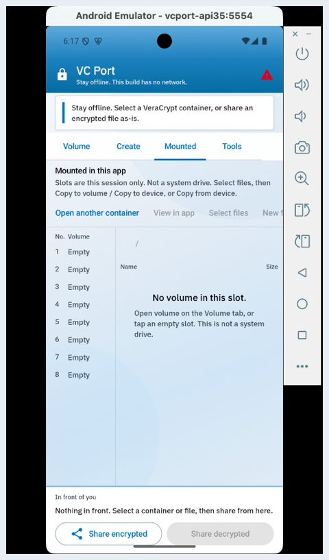
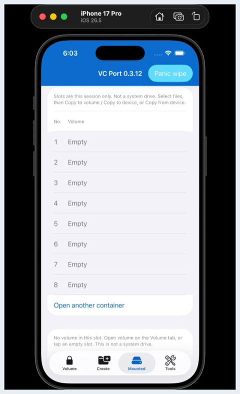
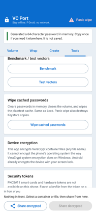
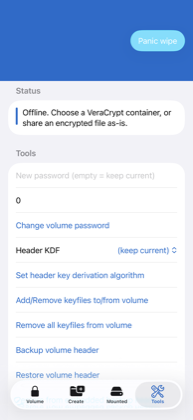
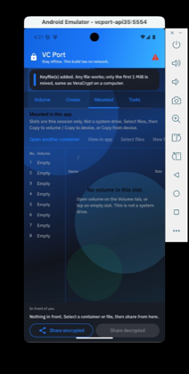

# VC Port

Open the same **locked files** on your **phone** that you use on a computer with VeraCrypt.

This app is **not** called VeraCrypt. It is **not unbreakable**. It is **100% free**.

**Support (optional)** — same features for everyone; support does not unlock extras or stronger encryption. Links are on GitHub only, not inside the app.

More: [SUPPORT.md](SUPPORT.md)

## Download

**0.3.12** — **proof of concept** (stable alpha: still testing, not a store app, not production-ready) (On Feature Freez).

| Phone | What to get |
| --- | --- |
| **Android** | [Latest release](https://github.com/ShivamPingaleDev/Veracrypt_port/releases/latest) — one APK (debug-signed preview) |
| **iPhone** | Same page — unsigned IPA; you install with **your Apple ID** via AltStore or SideStore |

On iPhone: download IPA → open in AltStore/SideStore → sign in with your Apple ID → Trust in Settings → open VC Port.  
More steps: [ports/ios/README.md](ports/ios/README.md)

### Proof of concept (what that means here)

GitHub releases are **demos** that show VeraCrypt-compatible volumes can be opened, edited, and saved back on a phone. They are useful for feedback and cross-device tests, but:

- APKs are **debug-signed previews**; IPAs are **unsigned**
- Container save-back, SAF/Files URIs, OTG, and multi-mount are still being hardened
- Host Python tests and emulator walks do not replace testing on your own phone and desktop VeraCrypt

Do not treat a GitHub download as a finished security product. Sign your own production build when you trust the tree.

#### Feature Freez.

Currently Focusing on my academics so I am not going to add new features, Please improve upon this and please suggest new one for next iteration of app.

## What it does

A locked file is a single file (for example `.hc`). On a PC, VeraCrypt opens it as a drive. A phone cannot do that. VC Port unlocks it **inside the app**:

1. Pick the locked file.
2. Type the password (and keyfiles / PIM if you use them).
3. Browse folders on the **Mounted** tab and copy or move files.
4. **Dismount** or **Panic wipe** closes it and clears secrets on the phone. The locked file on disk is not deleted.

You can also **Create** a new locked file. Use the **same password** on a computer later.

- Works **offline** (no internet permission in this build).
- Android can scan a **USB disk** (experimental).
- A forced password still opens the volume — use a long password and keep keyfiles off the phone.

## Screenshots (0.3.12)

Emulator UI, empty tabs. Click a picture for full size. [How we capture these](ports/docs/screenshots/README.md).

### Volume

| Android | iPhone |
| --- | --- |
|  |  |

### Create

| Android | iPhone |
| --- | --- |
|  |  |

### Mounted

| Android | iPhone |
| --- | --- |
|  |  |

### Tools

| Android | iPhone |
| --- | --- |
|  |  |

### Dark mode (Android)

| Android |
| --- |
|  |

## License (short)

The volume engine is **VeraCrypt** source. That **inherits** **TrueCrypt License 3.0** plus Apache-2.0. TrueCrypt 3.0 is **not OSI / FSF / Debian-free**; public source is required when binaries ship. GitHub APKs are **debug-signed** previews — not production-signed store builds.

Details: [License.txt](License.txt), [ports/FOSS.md](ports/FOSS.md)

## More

| | |
| --- | --- |
| Build from source | [PORTING.md](PORTING.md) |
| Security issues | [SECURITY.md](SECURITY.md) |
| Public talking points | [ports/PUBLIC.md](ports/PUBLIC.md) |

**Contact:** [shivampingaledev@proton.me](mailto:shivampingaledev@proton.me)

This repo is named Veracrypt_port because it includes VeraCrypt source. The app on the phone is **VC Port**. Use official VeraCrypt on a PC or Mac — this project does not ship a desktop app.
