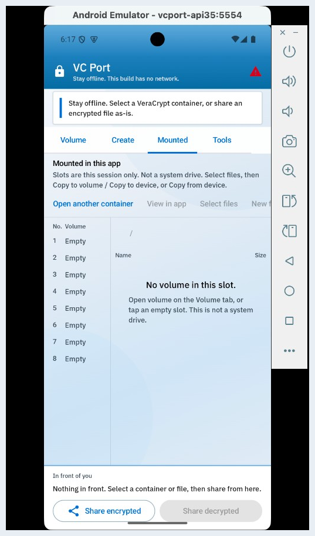
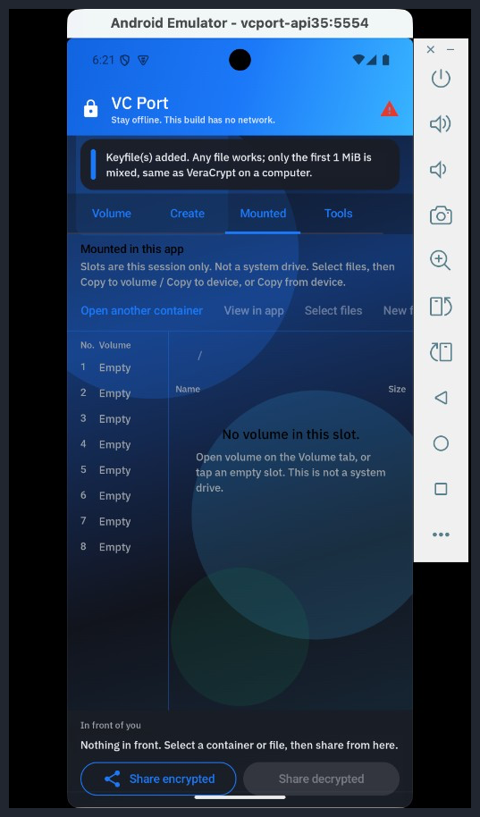

> “We must defend our own privacy if we expect to have any.”
> — Eric Hughes, *A Cypherpunk’s Manifesto* (1993)

# VC Port

VC Port lets you open the same locked files on your **phone** that you already use on a computer.

This app is **not** called VeraCrypt. We are not allowed to use that name. It is **not unbreakable**.

## How it works

A locked file (a *volume*) is just a file on disk. On a computer, VeraCrypt can attach it as a drive letter. A phone cannot do that.

This app does the next-best thing:

1. You pick the locked file. Any name is fine (`.hc`, `.jpg`, …). The name is only a disguise.
2. You type the password (and PIM / keyfiles if you use them). Nothing is stored.
3. The app unlocks the file in RAM and shows the folders on the **Mounted** tab. That is not a system drive — only this app can see it.
4. You copy files in or out. The file on disk stays locked the whole time.
5. **Dismount**, Home, or **Panic wipe** closes it and clears secrets on this phone. The locked file itself is not deleted.

**Create** makes a new locked file. After you save it, type the password again to open it. Same password opens it on a PC or Mac.

**Wrap** is a separate trick: one extra password on a single file (`.vcpw`). It is not a volume.

A compelled password still wins. Prefer a long password and a keyfile.

## Phones (the main thing)

**Android** and **iPhone**. That is what this project is for.

- Open a locked file and look at the folders inside
- Keep several volumes mounted and move files between them
- Make a new locked file
- Send the locked file as-is (no password on the send)
- Lock one extra file with its own password
- Stay offline
- Wipe this phone’s secrets if you need to

On **iPhone**, you **sign** the app yourself with **your Apple ID**. We do not sign it for you.

Try-out copies are on the [GitHub Release](https://github.com/ShivamPingaleDev/Veracrypt_port/releases/tag/v0.3.4). Those are test files, not store files. Installing one Android copy replaces the others.

**Volume** — pick a locked file and type the password.

**Create** — make a new locked file.

**Mounted** — folders inside. Slots are this session only. Not a system drive.

**Tools** — wrap a file, change the volume password, appearance.

How to build the phones: [PORTING.md](PORTING.md). Official VeraCrypt `src/` is in this folder so volumes stay compatible. On a computer, use official VeraCrypt — this project does not ship a PC or Mac app.

## Appearance (least important)

Original is the VeraCrypt-like look. Dark mode is a dark theme. Not required. Not the point of the app.

**Contact:** Shivam Mangesh Pingale — [shivampingaledev@proton.me](mailto:shivampingaledev@proton.me) · [shivampingaledev@gmail.com](mailto:shivampingaledev@gmail.com)

**Footnote:** A programming noob still doing a five-year IT engineering degree (graduate summer 2027). Just trying to make something better that he likes to use, without much knowledge. Open to suggestions and advice.

If this work is useful to you and you have room to **teach**, offer an **internship**, or **hire**: I am looking for that. Same email as Contact. No pressure.

Problems that can hurt people: [SECURITY.md](SECURITY.md). How to talk about this in public: [ports/PUBLIC.md](ports/PUBLIC.md).

This folder also has the original VeraCrypt source. Use it only if you accept [License.txt](License.txt). A copy must not be called VeraCrypt or TrueCrypt.

> “Cypherpunks write code.”
> — Eric Hughes, *A Cypherpunk’s Manifesto* (1993)
