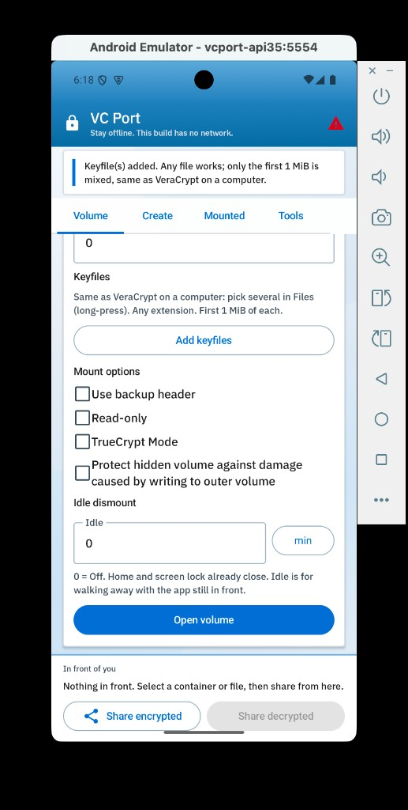
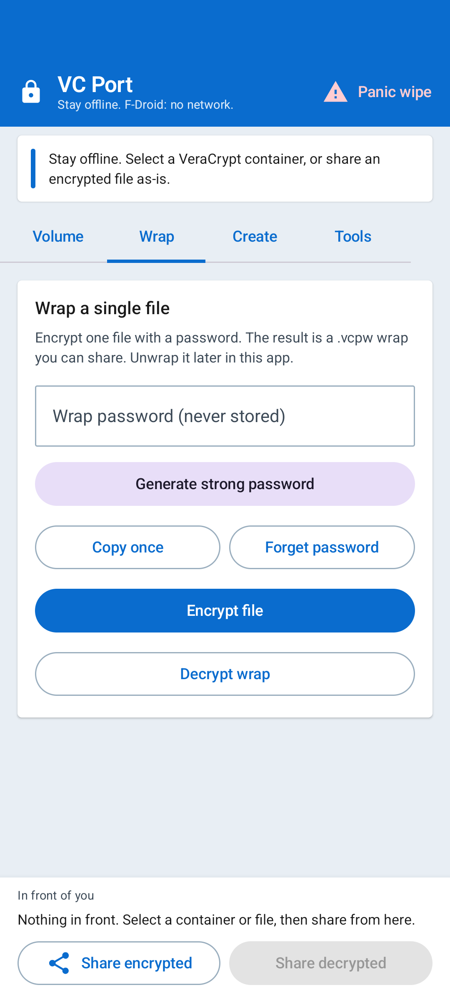
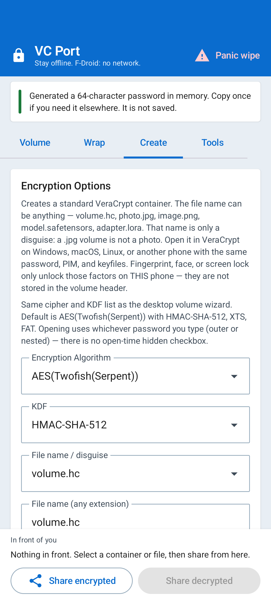
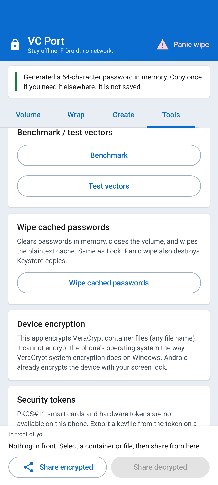

# VC Port

VC Port opens **VeraCrypt-compatible** encrypted file containers on **Android** and **iPhone**. Offline by default. This derived work is **not named VeraCrypt**. It is **not unbreakable**.

Package id: `dev.shivampingale.vcport`

**Contact:** Shivam Mangesh Pingale — [shivampingaledev@proton.me](mailto:shivampingaledev@proton.me) · [shivampingaledev@gmail.com](mailto:shivampingaledev@gmail.com)

**Footnote:** A programming noob still doing a five-year IT engineering degree (graduate summer 2027). Just trying to make something better that he likes to use, without much knowledge. Open to suggestions and advice.

If this work is useful to you and you have room to **teach**, offer an **internship**, or **hire**: I am looking for that. Same email as Contact. No pressure.

The full macOS port and VeraCrypt source tree live in [Veracrypt_port](https://github.com/ShivamPingaleDev/Veracrypt_port). This repo is the mobile apps plus the shared native core.

**VeraCrypt updates:** see [UPSTREAM.md](UPSTREAM.md). Official git and GitHub latest-release URLs are hardcoded in `ports/version.json`. The apps never fetch `src/` or install themselves. When they publish a release, a maintainer runs `scripts/sync-upstream.sh` and ships a new VC Port build.

**F-Droid / FOSS:** see [FOSS.md](FOSS.md). **Privacy:** [PRIVACY.md](PRIVACY.md). **Seizure / whistleblower profile:** [THREAT-MODEL.md](THREAT-MODEL.md). **Testing:** [tests/TESTING.md](tests/TESTING.md). **Public / how to talk about it:** [PUBLIC.md](PUBLIC.md).

## Screenshots

Real UI from the F-Droid debug app on emulator `vcport-api35` (Compose capture; `FLAG_SECURE` stays on, so `adb screencap` is black). Not F-Droid store mockups.






## What it does

- Open a VeraCrypt container (FAT folder browse and file extract; exFAT unsupported)
- Create a file container with the desktop cipher/KDF list, PIM, keyfiles, and nested (hidden) volume
- Protect a nested volume while the outer is open (desktop Mount Options)
- Change password / header KDF / keyfiles; backup and restore headers
- Biometric unlock (Android Keystore / Face ID / Touch ID) as a password factor, combinable with a text password, keyfiles, and PIM
- System share sheet (WhatsApp, Gmail, Drive, Mail, AirDrop, …)
- Share encrypted `.hc` / `.tc` / `.vera` files as-is
- Wrap or unwrap a single file (`.vcpw`) with a password that is never stored
- Strong password generator (in memory only, no history)
- Offline by default. The F-Droid Android flavor has no network permission. iOS update checks are off unless you set `VCPortEnableUpdateCheck`.

## Layout

```
android/     Kotlin / Compose app (F-Droid `fdroid` flavor)
ios/         SwiftUI sources + XcodeGen + AltStore source JSON
shared/      Native volume + wrap core (C/C++)
tests/       Host tests (no phone required)
fdroiddata/  Recipe to copy into F-Droid's fdroiddata repo
```

## Native core

The JNI/CMake build needs the VeraCrypt `src` tree from Veracrypt_port:

```bash
git clone https://github.com/ShivamPingaleDev/Veracrypt_port.git veracrypt
```

Or set `VC_SRC` to that clone's `src` directory.

Host wrap test (macOS or Linux):

```bash
./shared/run_wrap_test.sh
```

## Android

```bash
cd android
./gradlew :app:assembleFdroidRelease   # F-Droid / FOSS (no INTERNET)
./gradlew :app:assembleGithubDebug     # optional in-app update check
./gradlew :app:assembleStyledRelease   # Looks APK (dev.shivampingale.vcport.looks), not the store app
```

`minSdk` 28, `applicationId` `dev.shivampingale.vcport`. No Google Play libraries.

## iOS

There is no F-Droid for iPhone. Apple users **sign it themselves** with their Apple ID (AltStore / SideStore or Xcode). The GitHub IPA is unsigned on purpose. See `ios/README.md` and [FOSS.md](FOSS.md).

```bash
cd ios
./build-native.sh
xcodegen generate    # brew install xcodegen
```

## License

Same terms as VeraCrypt (Apache 2.0 / TrueCrypt 3.0). You may not call this app VeraCrypt.

Portions of this product are based in part on TrueCrypt, freely available at http://www.truecrypt.org/
