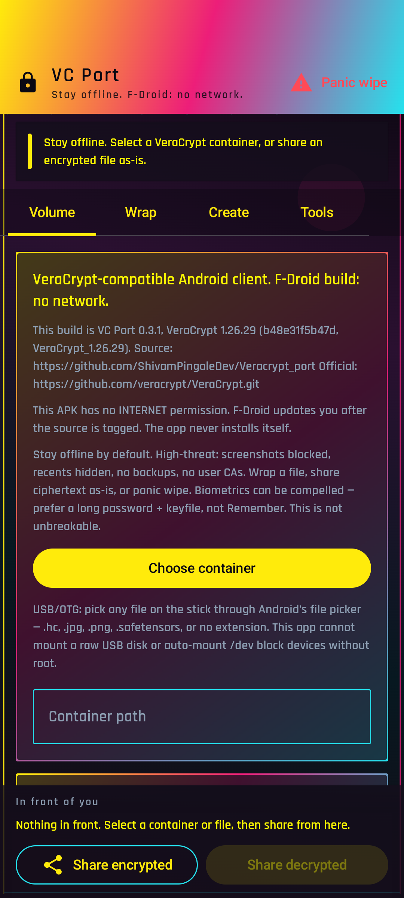
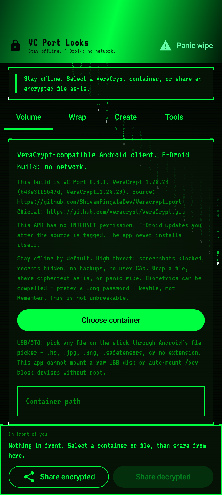
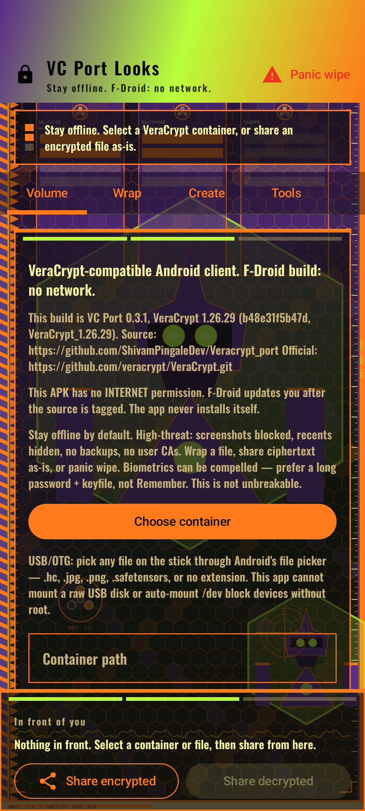

> “We must defend our own privacy if we expect to have any.”
> — Eric Hughes, *A Cypherpunk’s Manifesto* (1993)

# VC Port

VC Port lets you open the same locked files on your **phone** that you already use on a computer.

This app is **not** called VeraCrypt. We are not allowed to use that name. It is **not unbreakable**.

## Phones (the main thing)

**Android** and **iPhone**. That is what this project is for.

- Open a locked file and look at the folders inside
- Make a new locked file
- Send the locked file as-is (no password on the send)
- Lock one extra file with its own password
- Stay offline
- Wipe this phone’s secrets if you need to

On **iPhone**, you **sign** the app yourself with **your Apple ID**. We do not sign it for you.

Try-out copies are on the [GitHub Release](https://github.com/ShivamPingaleDev/Veracrypt_port/releases/tag/v0.3.1). Those are test files, not store files. Installing one Android copy replaces the others.

The full computer source lives in [Veracrypt_port](https://github.com/ShivamPingaleDev/Veracrypt_port). This repo is the phone apps.

## Mac (extra)

Mac computer extras (Apple chip, Touch ID) live in the full tree, not here. Not the main thing.

## Looks (least important)

Same phone app. Optional paint: Cyberpunk, Matrix, MAGI, Signal. Not required. Not the point of the app.

**Contact:** Shivam Mangesh Pingale — [shivampingaledev@proton.me](mailto:shivampingaledev@proton.me) · [shivampingaledev@gmail.com](mailto:shivampingaledev@gmail.com)

**Footnote:** A programming noob still doing a five-year IT engineering degree (graduate summer 2027). Just trying to make something better that he likes to use, without much knowledge. Open to suggestions and advice.

If this work is useful to you and you have room to **teach**, offer an **internship**, or **hire**: I am looking for that. Same email as Contact. No pressure.

How to talk about this in public: [PUBLIC.md](PUBLIC.md). How to build: [FOSS.md](FOSS.md). iPhone signing: [ios/README.md](ios/README.md).

You may not call this app VeraCrypt. Portions of this product are based in part on TrueCrypt, freely available at http://www.truecrypt.org/

> “Cypherpunks write code.”
> — Eric Hughes, *A Cypherpunk’s Manifesto* (1993)
